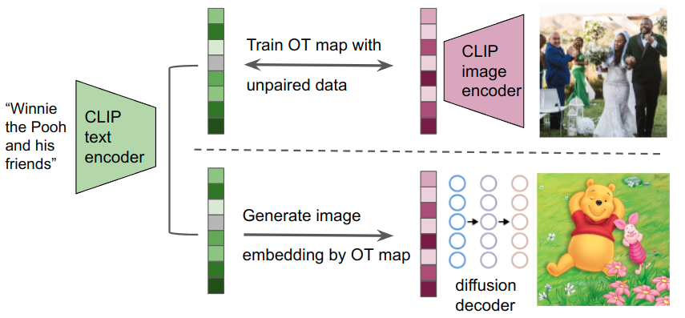

# Neural Monge map estimation and its applications

This is the official `Python` implementation of the paper **Neural Monge map estimation and its applications** (paper on [TMLR Featured Certification](https://openreview.net/forum?id=2mZSlQscj3&referrer=%5BTMLR%5D(%2Fgroup%3Fid%3DTMLR)), [Jiaojiao Fan](https://sbyebss.github.io/)\*, [Shu Liu](https://scholar.google.com/citations?user=LAnuQk0AAAAJ&hl=en)\*, [Shaojun Ma](https://www.linkedin.com/in/shaojun-ma-074203a1/), [Haomin Zhou](https://hmzhou.math.gatech.edu/)), and [Yongxin Chen](https://yongxin.ae.gatech.edu/).

The repository includes reproducible PyTorch source code for:

1. Unpaired text to image generation on DALLE2 backbone.
2. Unpaired class-preserving map.
3. Unpaired inpainting on the CelebA 128x128 dataset using Monge maps.
4. Transport between synthetic datasets.
5. Other toy examples

<p align="center"></p>

## Installation

Install pytorch, torchvision, then run

```bash
pip install --no-deps -r requirements.txt
```

## Repository structure

The repository highly depends on the [pytorch-lightning template](https://github.com/ashleve/lightning-hydra-template). The hyper-parameters are stored in `configs/`.

## Reproduction Instructions

Outputs are saved in the logs directory:

- Training outputs and checkpoints: logs/reproduce

- Testing outputs: logs/test

The dataset dir (defined in [config.yaml](configs/config.yaml#L45)) is set to be `datasets` in default.

Note: Currently, training is only supported on a single GPU. We set [trainer.devices](configs/trainer/default.yaml#L3)=[gpu_id] default as 0. Replace "gpu_id" with your GPU id.

### Unpaired text to image

Step1: prepare text and image CLIP embeddings

```bash
bash bash/txt2img_dataset_processing.sh
```

The folder structure of text-to-image datasets

```markdown
./datasets/laion-art_test
|- laion_art
|  |- laion-art.parquet
|- laion-art-en
|  |- laion-art-en.parquet
|- laion-high-resolution-en
|  |- clip_emb
|  |  |- img_emb
|  |  |- img_emb_reorder
|  |  |- text_emb
|  |  |- text_emb_reorder
|  |  |- metadata
|  |  |- stats
|  |- 00000.tar
|  |- 00000.parquet
|  |- 00000_stats.json
|  |- 00001.tar
|  |- 00001.parquet
|  |- 00001_stats.json
|- ...
```

```markdown
./datasets/cc3m_test
|- cc3m_no_watermark.tsv
|- cc3m_no_watermark
|  |- clip_emb
|  |  |- img_emb
|  |  |- img_emb_reorder
|  |  |- text_emb
|  |  |- text_emb_reorder
|  |  |- metadata
|  |  |- stats
|  |- 00000.tar
|  |- 00000.parquet
|  |- 00000_stats.json
|  |- 00001.tar
|  |- 00001.parquet
|  |- 00001_stats.json
|- ...
```


Step2: training and testing

```bash
bash bash/txt2img.sh
```
We need to load diffusion decoder for sampling, the default GPU device for that is set as `cuda:1` in [txt2img_callbacks](src/callbacks/txt2img_callbacks.py#L159).

### Class-preserving Monge map

```bash
bash bash/class_preserving_map.sh
```

### Unpaired inpainting

Based on the `data_dir` parameter in `configs/config.yaml`, please download the celebA dataset and put it in the `data_dir` folder. We don't need the label information thanks to the unpair property of our algorithm. So you just need to split the images into 📂train_source, 📂train_target, and 📂test folders with ratio 0.45 : 0.45 : 0.1. `data_dir` folder should have the following structure. The naming format of images doesn't have to follow the template below.

```
📂celeba
 ┣ 📂train_source
  ┣ 📂images
    ┣ 📜000001.jpg
    ┣ 📜000002.jpg
    ┣ 📜...
 ┣ 📂train_target
  ┣ 📂images
    ┣ 📜000001.jpg
    ┣ 📜000002.jpg
    ┣ 📜...
 ┣ 📂test
  ┣ 📂images
    ┣ 📜000001.jpg
    ┣ 📜000002.jpg
    ┣ 📜...
```

Then run the following command to train the model. The [trainer.devices](https://pytorch-lightning.readthedocs.io/en/1.6.0/accelerators/gpu.html#select-gpu-devices) is the list of GPU you have.

```bash
bash bash/inpainting.sh
```

### Toy examples

Please run the notebooks in the `toy_examples` folder.


## Citation

```
@article{
fan2023neural,
title={Neural Monge Map estimation and its applications},
author={Jiaojiao Fan and Shu Liu and Shaojun Ma and Hao-Min Zhou and Yongxin Chen},
journal={Transactions on Machine Learning Research},
issn={2835-8856},
year={2023},
url={https://openreview.net/forum?id=2mZSlQscj3},
note={Featured Certification}
}
```

## Contact

For any inquiries, please feel free to reach out:

- Jiaojiao Fan: jiaojiaofan@gatech.edu

- Shu Liu: shuliu@math.ucla.edu
