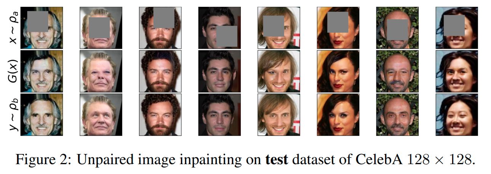

# Scalable Computation of Monge Maps with General Costs

This is the official `Python` implementation of the paper **Scalable Computation of Monge Maps with General Costs** (paper on [openreview](https://openreview.net/pdf?id=rEnGR3VdDW5), [Jiaojiao Fan](https://sbyebss.github.io/)\*, Shu Liu\*, Shaojun Ma\*, [Yongxin Chen](https://yongxin.ae.gatech.edu/), and [Haomin Zhou](https://hmzhou.math.gatech.edu/)).

The repository contains reproducible `PyTorch` source code for inpainting CelebA 64\*64 or CelebA 128\*128 dataset with Monge map.

<p align="center"></p>

## Installation

```bash
pip install torch torchvision torchaudio --extra-index-url https://download.pytorch.org/whl/cu113

pip install --no-deps -r requirements.txt
```

## Repository structure

The repository highly depends on the [pytorch-lightning template](https://github.com/ashleve/lightning-hydra-template). The hyper-parameters are stored in `configs/`.

## Reproduce

Modify the `data_dir` parameter in `configs/config.yaml`. Download the celebA dataset and put it in the `data_dir` folder. We don't need the label information thanks to the unpair property of our algorithm. So you just need to split the images into 📂train_source, 📂train_target, and 📂test folders with ratio 0.45 : 0.45 : 0.1. `data_dir` folder should have the following structure. The naming format of images doesn't have to follow the template below.

```
📂celeba
 ┣ 📂train_source
  ┣ 📂images
    ┣ 📜000001.jpg
    ┣ 📜000002.jpg
    ┣ 📜...
 ┣ 📂train_target
  ┣ 📂images
    ┣ 📜000001.jpg
    ┣ 📜000002.jpg
    ┣ 📜...
 ┣ 📂test
  ┣ 📂images
    ┣ 📜000001.jpg
    ┣ 📜000002.jpg
    ┣ 📜...
```

Then run the following command to train the model. The [trainer.devices](https://pytorch-lightning.readthedocs.io/en/1.6.0/accelerators/gpu.html#select-gpu-devices) is the list of GPU you have.

```bash
python run.py name=celeb_64 experiment=inpainting_celeb64 model.n_inner_iter=5 model.coeff_mse=10000. trainer.devices="[0]" logger=wandb

python run.py name=celeb_128 experiment=inpainting_celeb128 model.n_inner_iter=10 trainer.devices="[0]" logger=wandb

```

The outputs are saved in folder `logs`.

See the [config](configs/experiment) for more experiment configs.

## Citation

```

@inproceedings{
fan2022monge,
title={Scalable Computation of Monge Maps with General Costs},
author={Jiaojiao Fan and Shu Liu and Shaojun Ma and Yongxin Chen and Hao-Min Zhou},
booktitle={ICLR Workshop on Deep Generative Models for Highly Structured Data},
year={2022},
url={https://openreview.net/forum?id=rEnGR3VdDW5}
}

```
